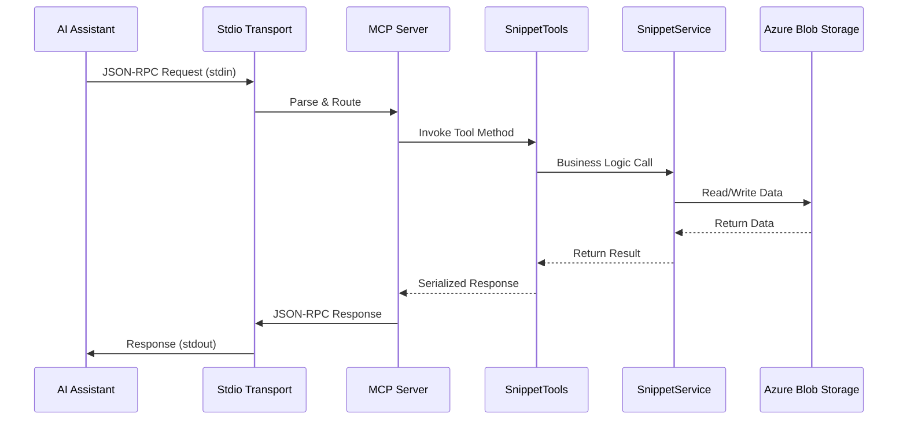

# MCP.Console - Model Context Protocol Standard I/O Server

> A production-ready Standard I/O (stdio) based Model Context Protocol (MCP) server implementation for AI assistant integration with code snippet management capabilities.

## 📋 Table of Contents

- [Introduction](#-introduction)
- [Architecture](#️-architecture)
- [Data Flow](#-data-flow)
- [Running the Server](#running-the-server)
- [Testing the Server](#testing-methods)

## 🌟 Introduction

The **MCP.Console** server is a comprehensive implementation of the Model Context Protocol (MCP) specification using Standard I/O transport. Built on .NET 9.0 with the official Microsoft MCP SDK, it provides seamless integration with AI assistants like Claude Desktop, VS Code with GitHub Copilot, and other MCP-enabled applications for code snippet management and sharing.

## 🏗️ Architecture

The MCP.Console server follows a clean, service-oriented architecture optimized for stdio transport:

```
┌────────────────────────────────────────────────────────────────────────────────────────────┐
│                                   MCP.Console Server                                       │
├────────────────────────────────────────────────────────────────────────────────────────────┤
│  ┌──────────────────────┐  ┌──────────────────────┐  ┌──────────────────────────────┐      │
│  │        Tools         │  │      Services        │  │           Models             │      │
│  │                      │  │                      │  │                              │      │
│  │  SnippetTools        │◄─┤  SnippetService      │  │        Snippet               │      │
│  │  EchoTool            │  │  AzBlobService       │  │        [JsonCtx]             │      │
│  │  [McpServerTool]     │  │    [Singleton]       │  │                              │      │
│  │                      │  │                      │  │                              │      │
│  └──────────────────────┘  └──────────────────────┘  └──────────────────────────────┘      │
├────────────────────────────────────────────────────────────────────────────────────────────┤
│                          .NET Host & Stdio Transport                                       │
│  ┌───────────────┐   ┌───────────────┐   ┌───────────────┐                                 │
│  │   Host/DI     │→──│  Stdio Comm.  │→──│   JSON-RPC    │                                 │
│  └───────────────┘   └───────────────┘   └───────────────┘                                 │
├────────────────────────────────────────────────────────────────────────────────────────────┤
│                                      Data Layer                                            │
│  ┌──────────────────────────────────────────────────────────────────────────────────────┐  │
│  │                         Azure Blob Storage                                           │  │
│  │                    Code Snippets Repository                                          │  │
│  └──────────────────────────────────────────────────────────────────────────────────────┘  │
└────────────────────────────────────────────────────────────────────────────────────────────┘
```

## 🔄 Data Flow

### Standard MCP Request Flow



## 🛠️ Available Tools

### Snippet Management Tools
- **save_snippet**: Save code snippets to Azure Blob Storage
- **get_snippets**: Retrieve saved code snippets by name
- **hello**: Simple hello world tool for testing

### Echo Tools (Testing)
- **Echo**: Echoes the message back to the client
- **ReverseEcho**: Echoes the message in reverse

## Running the Server

### Command Line Execution
```bash
cd MCP.Console
dotnet run
```

The server will start and wait for MCP protocol messages via stdin/stdout.

## Testing Methods

### Method 1: Using MCP Inspector
```bash
# Install MCP Inspector
npm install -g @modelcontextprotocol/inspector

# Run with MCP Inspector
npx @modelcontextprotocol/inspector dotnet run
```

### Method 2: Using VS Code with GitHub Copilot

Create a `.vscode/mcp.json` file in your workspace:

```json
{
    "inputs": [],
    "servers": {
        "snippet-manager": {
            "type": "stdio",
            "command": "dotnet",
            "args": [
                "run",
                "--project",
                "PATH_TO_YOUR_PROJECT\\MCP.Console\\MCP.Console.csproj"
            ],
            "env": {}
        }
    }
}
```

**Important**: Update the project path to match your actual file system location.


## ⚙️ Configuration

The server uses `appsettings.json` for configuration:

```json
{
  "Logging": {
    "LogLevel": {
      "Default": "Information",
      "Microsoft": "Warning"
    }
  },
  "ConnectionStrings": {
    "BlobStorage": "your-azure-blob-storage-connection-string"
  }
}
```

### Required Configuration
- **BlobStorage**: Azure Blob Storage connection string for snippet persistence
