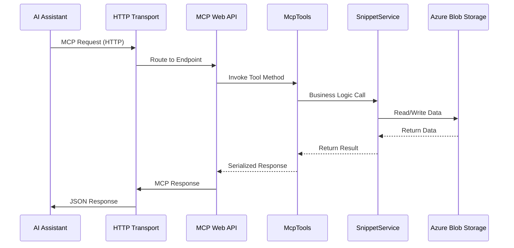

# MCP.HTTP.EntraAuth - Model Context Protocol Web API Server with Entra ID Authentication

> A production-ready ASP.NET Core Web API based Model Context Protocol (MCP) server implementation for web-hosted AI assistant integration with snippet management capabilities using HTTP transport and Microsoft Entra ID device code authentication.

## 🔐 Authentication Setup

This server uses Microsoft Entra ID (Azure AD) device code flow for authentication. Follow these steps to configure it:

### 1. Create an Entra ID App Registration

1. Go to the [Azure Portal](https://portal.azure.com)
2. Navigate to **Azure Active Directory** > **App registrations**
3. Click **New registration**
4. Configure the application:
   - **Name**: `MCP.HTTP.EntraAuth Server`
   - **Supported account types**: Choose based on your requirements
   - **Redirect URI**: Leave blank (not needed for device code flow)
5. Click **Register**

### 2. Configure the App Registration

After creating the app registration:

1. **Application (client) ID**: Copy this value for your configuration
2. **Directory (tenant) ID**: Copy this value for your configuration

#### Configure Expose an API
1. Go to **Expose an API**
2. Set the **Application ID URI** (e.g., `api://your-client-id`)
3. Add scopes:
   - **snippets:read**: Read access to code snippets
   - **snippets:write**: Write access to code snippets

#### Configure API Permissions
1. Go to **API permissions**
2. Ensure the application has the following permissions:
   - **Microsoft Graph**: `User.Read` (for basic user information)

### 3. Update Configuration

Update your `appsettings.json` file:

```json
{
  "AzureAd": {
    "Instance": "https://login.microsoftonline.com/",
    "TenantId": "<<YOUR_TENANT_ID>>",
    "ClientId": "<<YOUR_CLIENT_ID>>"
  },
  "ConnectionStrings": {
    "BlobStorage": "UseDevelopmentStorage=true"
  }
}
```

Replace the placeholders:
- `<<YOUR_TENANT_ID>>`: The Directory (tenant) ID from your app registration
- `<<YOUR_CLIENT_ID>>`: The Application (client) ID from your app registration

## 📋 Table of Contents

- [Introduction](#-introduction)
- [Architecture](#️-architecture)
- [Data Flow](#-data-flow)
- [Running the Server](#running-the-server)
- [Integration with AI Assistants](#integration-with-ai-assistants)

## 🌟 Introduction

The **MCP.HTTP.EntraAuth** server is a native implementation of the Model Context Protocol (MCP) specification using ASP.NET Core with HTTP transport and device code authentication. Built on .NET 9.0 with the official Microsoft MCP SDK for ASP.NET Core, it provides secure, web-hosted integration with AI assistants like Claude Desktop, VS Code with GitHub Copilot, and other MCP-enabled applications.

## 🏗️ Architecture

The MCP.HTTP.EntraAuth server follows a modern web API architecture optimized for HTTP transport with device code authentication:

```
┌────────────────────────────────────────────────────────────────────────────────────────────┐
│                                MCP.HTTP.EntraAuth Server                                   │
├────────────────────────────────────────────────────────────────────────────────────────────┤
│  ┌──────────────────────┐  ┌──────────────────────┐  ┌──────────────────────────────┐      │
│  │        Tools         │  │      Services        │  │           Models             │      │
│  │                      │  │                      │  │                              │      │
│  │  McpTools            │◄─┤  SnippetService      │  │        Snippet               │      │
│  │  [McpServerTool]     │  │  AzBlobService       │  │        DeviceCodeResult      │      │
│  │                      │  │  AuthStateService    │  │                              │      │
│  │                      │  │    [Singleton]       │  │                              │      │
│  └──────────────────────┘  └──────────────────────┘  └──────────────────────────────┘      │
├────────────────────────────────────────────────────────────────────────────────────────────┤
│                         ASP.NET Core Web API & HTTP Transport                              │
│  ┌───────────────┐   ┌───────────────┐   ┌───────────────┐   ┌───────────────┐            │
│  │   HTTP Host   │→──│  MCP Routing  │→──│   JSON-RPC    │→──│ Device Code   │            │
│  └───────────────┘   └───────────────┘   └───────────────┘   └───────────────┘            │
├────────────────────────────────────────────────────────────────────────────────────────────┤
│                                      Data Layer                                            │
│  ┌──────────────────────────────────────────────────────────────────────────────────────┐  │
│  │                         Azure Blob Storage                                           │  │
│  │                    Code Snippets Repository                                          │  │
│  └──────────────────────────────────────────────────────────────────────────────────────┘  │
└────────────────────────────────────────────────────────────────────────────────────────────┘
```

## 🔄 Data Flow

### HTTP MCP Request Flow with Device Code Authentication



## 🛠️ Available Tools

### Authentication Tools
- **start_authentication**: Start Entra ID device code authentication flow
- **check_authentication_status**: Check if device code authentication is complete and get Entra ID access token
- **get_connection**: Get authenticated MCP connection details

### Snippet Management Tools
- **save_snippet**: Save code snippets to Azure Blob Storage with authentication
- **get_snippet**: Retrieve saved code snippets by name
- **list_snippets**: List all available code snippets
- **delete_snippet**: Delete a specific code snippet

## 🔑 Authentication Flow

This server implements a dual authentication approach for maximum flexibility:

### 1. Session-based Authentication (Backward Compatible)
- Use `start_authentication` to initiate device code flow
- Poll `check_authentication_status` until authentication completes
- Pass `sessionId` parameter to subsequent tool calls

### 2. Direct Token Authentication (Recommended)
- Complete the device code flow to obtain an Entra ID access token
- The `check_authentication_status` tool returns the Entra ID access token directly
- Pass `jwtToken` parameter (Entra ID access token) to subsequent tool calls

### Token Details
- **Entra ID Access Tokens**: The server returns Microsoft Entra ID access tokens in JWT format
- **Native JWT Validation**: Uses ASP.NET Core's built-in JWT Bearer authentication
- **No Custom Wrapping**: Entra ID tokens are used directly without additional JWT layers
- **Security**: Tokens are validated against the configured Entra ID authority and audience

### Example Authentication Flow
```javascript
// 1. Start authentication
const authResponse = await client.callTool("start_authentication");
console.log(authResponse.deviceCodeUrl); // Visit URL and enter code

// 2. Poll for completion
let statusResponse;
do {
    await new Promise(resolve => setTimeout(resolve, 5000)); // Wait 5 seconds
    statusResponse = await client.callTool("check_authentication_status", {
        sessionId: authResponse.sessionId
    });
} while (!statusResponse.authenticated);

// 3. Use the Entra ID access token for subsequent calls
const snippets = await client.callTool("list_snippets", {
    jwtToken: statusResponse.accessToken // This is the Entra ID JWT token
});
```

## Running the Server

### Local Development

#### Prerequisites
- .NET 9.0 SDK
- Azure Storage Account or Development Storage (Azurite)

#### Command Line Execution
```bash
cd MCP.HTTP.EntraAuth
dotnet run
```

The server will start and be available at:
- HTTP: `http://localhost:5120`

#### Using Visual Studio Code
1. Open the project in VS Code
2. Press F5 to start debugging
3. The server will launch with the configured ports

#### Using Visual Studio
1. Open the solution file
2. Set MCP.HTTP.EntraAuth as the startup project
3. Press F5 or Ctrl+F5 to run

### Production Deployment

The server can be deployed to:
- Azure App Service
- Docker containers
- IIS
- Any hosting environment that supports ASP.NET Core

## Integration with AI Assistants

### VS Code GitHub Copilot

Configure in your workspace's `.vscode/mcp.json`:

```json
{
    "inputs": [],
    "servers": {
        "snippet-manager": {
            "type": "http",
            "url": "https://your-domain.com",
            "headers": {
                "Authorization": "Bearer your-api-key"
            }
        }
    }
}
```

For local development:

```json
{
    "inputs": [],
    "servers": {
        "snippet-manager-local": {
            "type": "http",
            "url": "http://localhost:5120"
        }
    }
}
```

## ⚙️ Configuration

### appsettings.json
```json
{
  "Logging": {
    "LogLevel": {
      "Default": "Information",
      "Microsoft.AspNetCore": "Warning"
    }
  },
  "ConnectionStrings": {
    "BlobStorage": "UseDevelopmentStorage=true"
  },
  "AzureAd": {
    "Instance": "https://login.microsoftonline.com/",
    "TenantId": "<<YOUR_TENANT_ID>>",
    "ClientId": "<<YOUR_CLIENT_ID>>"
  },
  "APPLICATIONINSIGHTS_CONNECTION_STRING": ""
}
```

### Required Configuration
- **BlobStorage**: Azure Blob Storage connection string for snippet persistence
- **AzureAd**: Microsoft Entra ID configuration for device code authentication
- **TenantId**: Your Azure AD tenant ID
- **ClientId**: Your Azure AD application (client) ID

### Development Storage
For local development, you can use:
- Azure Storage Emulator (legacy)
- Azurite (recommended)
- Set `BlobStorage` to `"UseDevelopmentStorage=true"`
