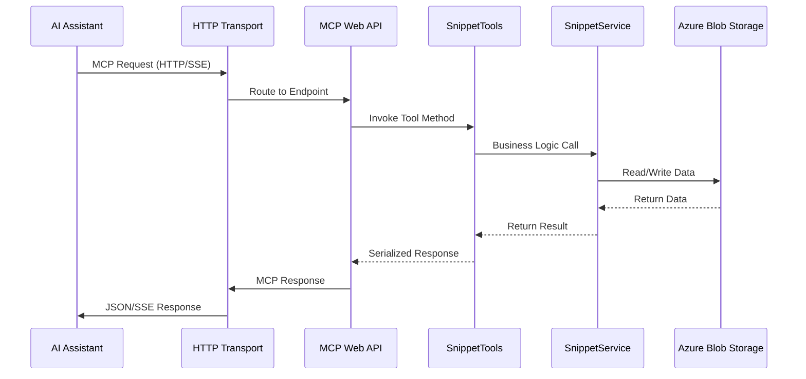

# MCP.SSE - Model Context Protocol Web API Server with Entra ID Authentication

> A production-ready ASP.NET Core Web API based Model Context Protocol (MCP) server implementation for web-hosted AI assistant integration with snippet management capabilities using Server-Sent Events (SSE) and Microsoft Entra ID authentication.

## 🔐 Authentication Setup

This server uses Microsoft Entra ID (Azure AD) for authentication. Follow these steps to configure it:

### 1. Create an Entra ID App Registration

1. Go to the [Azure Portal](https://portal.azure.com)
2. Navigate to **Azure Active Directory** > **App registrations**
3. Click **New registration**
4. Configure the application:
   - **Name**: `MCP.SSE Server`
   - **Supported account types**: Choose based on your requirements
   - **Redirect URI**: Leave blank for now
5. Click **Register**

### 2. Configure the App Registration

After creating the app registration:

1. **Application (client) ID**: Copy this value for your configuration
2. **Directory (tenant) ID**: Copy this value for your configuration

#### Configure Expose an API
1. Go to **Expose an API**
2. Set the **Application ID URI** (e.g., `api://your-client-id`)
3. Add scopes:
   - **mcp:tools**: Access to MCP tools
   - **mcp:resources**: Access to MCP resources

#### Configure App Roles (Optional)
1. Go to **App roles**
2. Create roles such as:
   - **MCP.User**: Basic access to MCP services
   - **MCP.Admin**: Administrative access to MCP services

### 3. Update Configuration

Update your `appsettings.json` file:

```json
{
  "AzureAd": {
    "Instance": "https://login.microsoftonline.com/",
    "Domain": "your-domain.onmicrosoft.com",
    "TenantId": "your-tenant-id",
    "ClientId": "your-client-id",
    "Audience": "api://your-client-id"
  },
  "Authentication": {
    "ServerUrl": "http://localhost:5000/",
    "RequiredScopes": ["mcp:tools", "mcp:resources"],
    "RequiredRoles": ["MCP.User"]
  }
}
```

Replace the placeholders:
- `your-domain`: Your Azure AD domain
- `your-tenant-id`: The Directory (tenant) ID
- `your-client-id`: The Application (client) ID

## 📋 Table of Contents

- [Introduction](#-introduction)
- [Architecture](#️-architecture)
- [Data Flow](#-data-flow)
- [Running the Server](#running-the-server)
- [Integration with AI Assistants](#integration-with-ai-assistants)

## 🌟 Introduction

The **MCP.SSE** server is a web-native implementation of the Model Context Protocol (MCP) specification using ASP.NET Core Web API with HTTP transport and Server-Sent Events. Built on .NET 9.0 with the official Microsoft MCP SDK for ASP.NET Core, it provides scalable, web-hosted integration with AI assistants like Claude Desktop, VS Code with GitHub Copilot, and other MCP-enabled applications.

## 🏗️ Architecture

The MCP.SSE server follows a modern web API architecture optimized for HTTP transport and SSE streaming:

```
┌────────────────────────────────────────────────────────────────────────────────────────────┐
│                                   MCP.SSE Server                                           │
├────────────────────────────────────────────────────────────────────────────────────────────┤
│  ┌──────────────────────┐  ┌──────────────────────┐  ┌──────────────────────────────┐      │
│  │        Tools         │  │      Services        │  │           Models             │      │
│  │                      │  │                      │  │                              │      │
│  │  SnippetTools        │◄─┤  SnippetService      │  │        Snippet               │      │
│  │  [McpServerTool]     │  │  AzBlobService       │  │        [JsonCtx]             │      │
│  │                      │  │    [Singleton]       │  │                              │      │
│  │                      │  │                      │  │                              │      │
│  └──────────────────────┘  └──────────────────────┘  └──────────────────────────────┘      │
├────────────────────────────────────────────────────────────────────────────────────────────┤
│                         ASP.NET Core Web API & HTTP Transport                              │
│  ┌───────────────┐   ┌───────────────┐   ┌───────────────┐   ┌───────────────┐            │
│  │   HTTP Host   │→──│  MCP Routing  │→──│   JSON-RPC    │→──│      SSE      │            │
│  └───────────────┘   └───────────────┘   └───────────────┘   └───────────────┘            │
├────────────────────────────────────────────────────────────────────────────────────────────┤
│                                      Data Layer                                            │
│  ┌──────────────────────────────────────────────────────────────────────────────────────┐  │
│  │                         Azure Blob Storage                                           │  │
│  │                    Code Snippets Repository                                          │  │
│  └──────────────────────────────────────────────────────────────────────────────────────┘  │
└────────────────────────────────────────────────────────────────────────────────────────────┘
```

## 🔄 Data Flow

### HTTP MCP Request Flow with SSE



## 🛠️ Available Tools

### Snippet Management Tools
- **save_snippet**: Save code snippets to Azure Blob Storage
- **get_snippets**: Retrieve saved code snippets by name
- **hello**: Simple hello world tool for testing

## Running the Server

### Local Development

#### Prerequisites
- .NET 9.0 SDK
- Azure Storage Account or Development Storage (Azurite)

#### Command Line Execution
```bash
cd MCP.SSE
dotnet run
```

The server will start and be available at:
- HTTP: `http://localhost:5116`
- HTTPS: `https://localhost:7095`

#### Using Visual Studio Code
1. Open the project in VS Code
2. Press F5 to start debugging
3. The server will launch with the configured ports

#### Using Visual Studio
1. Open the solution file
2. Set MCP.SSE as the startup project
3. Press F5 or Ctrl+F5 to run

### Production Deployment

The server can be deployed to:
- Azure App Service
- Docker containers
- IIS
- Any hosting environment that supports ASP.NET Core

## Integration with AI Assistants

### VS Code GitHub Copilot

Configure in your workspace's `.vscode/mcp.json`:

```json
{
    "inputs": [],
    "servers": {
        "snippet-manager-sse": {
            "type": "sse",
            "url": "https://your-domain.com",
            "headers": {
                "Authorization": "Bearer your-api-key"
            }
        }
    }
}
```

For local development:

```json
{
    "inputs": [],
    "servers": {
        "snippet-manager-local": {
            "type": "sse",
            "url": "http://localhost:5116"
        }
    }
}
```

## ⚙️ Configuration

### appsettings.json
```json
{
  "Logging": {
    "LogLevel": {
      "Default": "Information",
      "Microsoft.AspNetCore": "Warning"
    }
  },
  "AllowedHosts": "*",
  "ConnectionStrings": {
    "BlobStorage": "your-azure-blob-storage-connection-string"
  }
}
```

### Required Configuration
- **BlobStorage**: Azure Blob Storage connection string for snippet persistence
- **AllowedHosts**: Configure allowed hosts for production deployment

### Development Storage
For local development, you can use:
- Azure Storage Emulator (legacy)
- Azurite (recommended)
- Set `BlobStorage` to `"UseDevelopmentStorage=true"`
