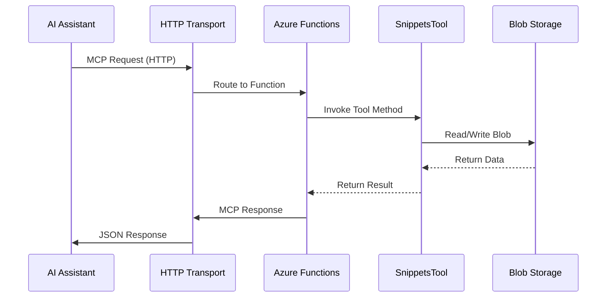

# MCP.Remote - Model Context Protocol Azure Functions Server

> A production-ready Azure Functions based Model Context Protocol (MCP) server implementation for cloud-hosted AI assistant integration with snippet management capabilities.

## 📋 Table of Contents

- [Introduction](#-introduction)
- [Architecture](#️-architecture)
- [Data Flow](#-data-flow)
- [Running the Server](#running-the-server)
- [Integration with AI Assistants](#integration-with-ai-assistants)

## 🌟 Introduction

The **MCP.Remote** server is a cloud-native implementation of the Model Context Protocol (MCP) specification using Azure Functions. Built on .NET 9.0 with the official Microsoft MCP SDK and Azure Functions Worker, it provides scalable, serverless integration with AI assistants like Claude Desktop, VS Code with GitHub Copilot, and other MCP-enabled applications.

## 🏗️ Architecture

The MCP.Remote server follows a serverless, cloud-native architecture optimized for Azure Functions:

```
┌────────────────────────────────────────────────────────────────────────────────────────────┐
│                                   MCP.Remote Server                                        │
├────────────────────────────────────────────────────────────────────────────────────────────┤
│  ┌──────────────────────┐  ┌──────────────────────┐  ┌──────────────────────────────┐      │
│  │        Tools         │  │      Functions       │  │           Storage            │      │
│  │                      │  │                      │  │                              │      │
│  │   SnippetsTool       │◄─┤   GetSnippet()       │  │      Azure Blob Storage      │      │
│  │   HelloTool          │  │   SaveSnippet()      │  │     (snippets/{name}.json)   │      │
│  │   [McpToolTrigger]   │  │   SayHello()         │  │                              │      │
│  │                      │  │                      │  │                              │      │
│  └──────────────────────┘  └──────────────────────┘  └──────────────────────────────┘      │
├────────────────────────────────────────────────────────────────────────────────────────────┤
│                         Azure Functions Runtime                                            │
│  ┌───────────────┐   ┌───────────────┐   ┌───────────────┐                                 │
│  │   HTTP Host   │→──│  MCP Protocol │→──│   JSON-RPC    │                                 │
│  └───────────────┘   └───────────────┘   └───────────────┘                                 │
├────────────────────────────────────────────────────────────────────────────────────────────┤
│                                    Azure Cloud                                             │
│  ┌──────────────────────────────────────────────────────────────────────────────────────┐  │
│  │                        Azure Blob Storage                                            │  │
│  │      Container: snippets/                                                            │  │
│  │      Files: {snippet-name}.json                                                      │  │
│  └──────────────────────────────────────────────────────────────────────────────────────┘  │
└────────────────────────────────────────────────────────────────────────────────────────────┘
```

## 🔄 Data Flow

### Azure Functions MCP Request Flow


## Running the Server

### Local Development

#### Prerequisites
- .NET 9.0 SDK
- Azure Functions Core Tools v4
- Azure Storage Emulator (Azurite) or Azure Storage Account

#### Command Line Execution
```bash
cd MCP.Remote

# Install Azure Functions Core Tools (if not installed)
npm install -g azure-functions-core-tools@4 --unsafe-perm true

# Start local development server
func start
```

The server will start and be available at `http://localhost:7071/api/` for HTTP requests.

#### Using Visual Studio Code
1. Open the project in VS Code
2. Install the Azure Functions extension
3. Press F5 to start debugging

## Integration with AI Assistants

### VS Code GitHub Copilot

Configure in your workspace's `.vscode/mcp.json`:

```json
{
    "inputs": [
        {
            "type": "promptString",
            "id": "functions-mcp-extension-system-key",
            "description": "Azure Functions MCP Extension System Key",
            "password": true
        },
        {
            "type": "promptString",
            "id": "functionapp-name",
            "description": "Azure Functions App Name"
        }
    ],
    "servers": {
        "remote-mcp-function": {
            "type": "sse",
            "url": "https://${input:functionapp-name}.azurewebsites.net/runtime/webhooks/mcp/sse",
            "headers": {
                "x-functions-key": "${input:functions-mcp-extension-system-key}"
            }
        }
    }
}
```


