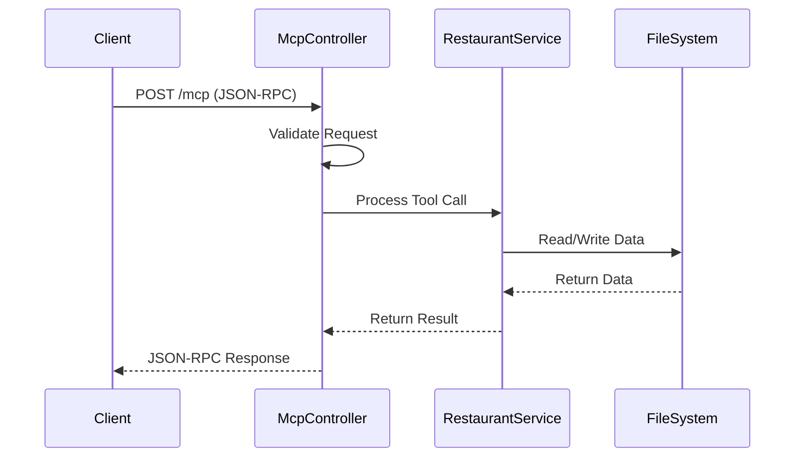
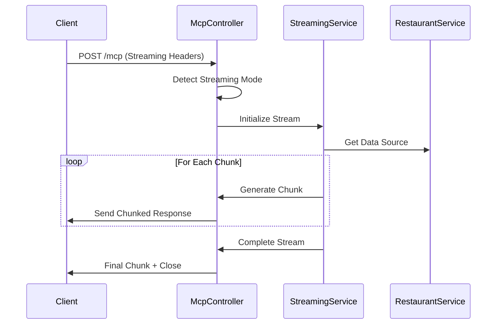

# MCP.http - Model Context Protocol Streaming Server

> A production-ready HTTP-based Model Context Protocol (MCP) server implementation with advanced chunked JSON streaming capabilities for restaurant management.

## 📋 Table of Contents

- [Introduction](#introduction)
- [Architecture](#architecture)
- [Data Flow](#data-flow)
- [Key Components](#key-components)
- [Local Development](#local-development)
- [Testing](#testing)
- [Deployment & CI/CD](#deployment--cicd)
- [API Reference](#api-reference)
- [Configuration](#configuration)

## 🌟 Introduction

The **MCP.http** server is a comprehensive implementation of the Model Context Protocol (MCP) specification with advanced streaming capabilities. Built on ASP.NET Core 9.0, it provides a robust foundation for AI assistant integrations with real-time data streaming support.

### Key Features

- **🔄 Real-time Streaming**: HTTP chunked transfer encoding for progressive data delivery
- **📡 MCP Protocol Compliance**: Full JSON-RPC 2.0 Model Context Protocol implementation
- **🏪 Restaurant Management**: Complete CRUD operations with intelligent data handling
- **⚡ High Performance**: Asynchronous operations with optimized data processing
- **🔧 Configurable**: Environment-based configuration with development/production profiles
- **🌐 CORS Support**: Cross-origin resource sharing for web client integration
- **📊 Comprehensive Logging**: Structured logging with request/response tracking

### Use Cases

- AI assistant backend services
- Real-time data streaming applications
- Restaurant recommendation systems
- MCP protocol testing and development
- Educational MCP implementations

## 🏗️ Architecture

The MCP.http server follows a clean architecture pattern with clear separation of concerns:

```
┌─────────────────────────────────────────────────────────────┐
│                        MCP.http Server                      │
├─────────────────────────────────────────────────────────────┤
│  ┌─────────────────┐  ┌─────────────────┐  ┌──────────────┐ │
│  │   Controllers   │  │    Services     │  │    Models    │ │
│  │                 │  │                 │  │              │ │
│  │ McpServer       │◄─┤ RestaurantSvc   │  │ JsonRpc      │ │
│  │ Controller      │  │ StreamingSvc    │  │ Restaurant   │ │
│  │                 │  │                 │  │ McpModels    │ │
│  └─────────────────┘  └─────────────────┘  └──────────────┘ │
├─────────────────────────────────────────────────────────────┤
│                   ASP.NET Core Pipeline                     │
│  ┌───────────┐ ┌───────────┐ ┌───────────┐ ┌─────────────┐ │
│  │   CORS    │→│   Auth    │→│  Routing  │→│  Controllers │ │
│  └───────────┘ └───────────┘ └───────────┘ └─────────────┘ │
├─────────────────────────────────────────────────────────────┤
│                      Data Layer                            │
│  ┌─────────────────────────────────────────────────────────┐ │
│  │          JSON File Storage (AppData)                    │ │
│  │    %APPDATA%/DemoMCP_Streaming/restaurants.json    │ │
│  └─────────────────────────────────────────────────────────┘ │
└─────────────────────────────────────────────────────────────┘
```

### Architectural Principles

- **Single Responsibility**: Each component has a well-defined purpose
- **Dependency Injection**: Loose coupling through DI container
- **Separation of Concerns**: Clear boundaries between layers
- **Asynchronous Processing**: Non-blocking operations throughout
- **Extensibility**: Plugin-based architecture for new tools

## 🔄 Data Flow

### Standard Request Flow



### Streaming Request Flow



### Tool Execution Pipeline

1. **Request Validation**: JSON-RPC 2.0 schema validation
2. **Method Routing**: Dispatch to appropriate handler
3. **Parameter Extraction**: Type-safe parameter parsing
4. **Tool Execution**: Business logic execution
5. **Response Formatting**: MCP-compliant response generation
6. **Streaming Detection**: Automatic streaming mode activation
7. **Content Delivery**: Regular or chunked response delivery

## 🔧 Key Components

### Core Components

#### 1. McpServerController
- **Purpose**: Main API endpoint handling all MCP requests
- **Responsibilities**:
  - JSON-RPC 2.0 protocol implementation
  - Request routing and validation
  - Streaming mode detection and activation
  - Error handling and response formatting

#### 2. RestaurantService
- **Purpose**: Business logic for restaurant management
- **Features**:
  - CRUD operations for restaurants
  - Visit tracking and statistics
  - Data persistence and retrieval
  - Random restaurant selection algorithms

#### 3. StreamingService
- **Purpose**: Real-time data streaming capabilities
- **Capabilities**:
  - Chunked JSON response generation
  - Progressive data loading
  - Stream state management
  - Metadata enrichment

### Data Models

#### JsonRpcRequest/Response
- Complete JSON-RPC 2.0 implementation
- Type-safe parameter handling
- Error response standardization

#### Restaurant Model
```csharp
public class Restaurant
{
    public string Id { get; set; }
    public string Name { get; set; }
    public string Location { get; set; }
    public string FoodType { get; set; }
    public DateTime DateAdded { get; set; }
}
```

#### MCP Tool Definitions
- Comprehensive tool metadata
- Parameter validation schemas
- Streaming capability indicators

### Available Tools

| Tool Name | Type | Description | Streaming |
|-----------|------|-------------|-----------|
| `get_restaurants` | Query | Retrieve all restaurants | ❌ |
| `add_restaurant` | Action | Add new restaurant | ❌ |
| `pick_random_restaurant` | Action | Random selection | ❌ |
| `get_visit_stats` | Query | Visit statistics | ❌ |
| `get_restaurants_stream` | Query | Progressive restaurant loading | ✅ |
| `analyze_restaurants_stream` | Query | Real-time analysis | ✅ |
| `search_restaurants_stream` | Query | Live search results | ✅ |

## 💻 Local Development

### Prerequisites

- **.NET 9.0 SDK** or later
- **Visual Studio 2022** (17.8+) or **VS Code** with C# extension
- **Git** for version control
- **PowerShell** (Windows) or **Bash** (Linux/macOS)

### Setup Instructions

#### 1. Clone Repository
```powershell
git clone <repository-url>
cd MCPDemo/MCP.http
```

#### 2. Restore Dependencies
```powershell
dotnet restore
```

#### 3. Configure Environment
```powershell
# Development settings are in appsettings.Development.json
# Copy and modify as needed
cp appsettings.json appsettings.Development.json
```

#### 4. Run the Application
```powershell
# Standard run
dotnet run

# Development with hot reload
dotnet watch run

# Specific environment
dotnet run --environment Production
```

#### 5. Verify Installation
```powershell
# Health check
curl http://localhost:5227/health

# MCP capabilities
curl -X POST http://localhost:5227/mcp \
  -H "Content-Type: application/json" \
  -d '{"jsonrpc":"2.0","id":1,"method":"initialize","params":{"protocolVersion":"2024-11-05"}}'
```

### Development Tools

#### Visual Studio Integration
- **Launch Profiles**: Configured in `launchSettings.json`
- **Debugging**: Full breakpoint and step-through support
- **IntelliSense**: Complete code completion and documentation

#### VS Code Integration
- **REST Client**: Use `MCP.http.http` file for API testing
- **C# Extension**: Syntax highlighting and debugging
- **Tasks**: Pre-configured build and run tasks

### File Structure
```
MCP.http/
├── Controllers/
│   └── McpServerController.cs     # Main API controller
├── Models/
│   ├── McpModels.cs              # MCP protocol models
│   └── RestaurantModels.cs       # Domain models
├── Services/
│   ├── RestaurantService.cs      # Business logic
│   └── StreamingService.cs       # Streaming functionality
├── Properties/
│   └── launchSettings.json       # Launch configurations
├── appsettings.json              # Application configuration
├── appsettings.Development.json  # Development overrides
├── MCP.http.csproj              # Project file
├── MCP.http.http                # REST client test file
├── Program.cs                   # Application entry point
└── README.md                    # This file
```

## 🧪 Testing

### Manual Testing

#### Using REST Client (VS Code)
The project includes a comprehensive `MCP.http.http` file with pre-configured requests:

```http
### Health Check
GET http://localhost:5227/health

### Initialize MCP Connection
POST http://localhost:5227/mcp
Content-Type: application/json

{
  "jsonrpc": "2.0",
  "id": 1,
  "method": "initialize",
  "params": {
    "protocolVersion": "2024-11-05",
    "capabilities": {}
  }
}

### List Available Tools
POST http://localhost:5227/mcp
Content-Type: application/json

{
  "jsonrpc": "2.0",
  "id": 2,
  "method": "tools/list"
}
```

#### Using cURL

##### Basic Tool Execution
```powershell
curl -X POST http://localhost:5227/mcp `
  -H "Content-Type: application/json" `
  -d '{
    "jsonrpc": "2.0",
    "id": 3,
    "method": "tools/call",
    "params": {
      "name": "get_restaurants"
    }
  }'
```

##### Streaming Tool Execution
```powershell
curl -X POST http://localhost:5227/mcp `
  -H "Content-Type: application/json" `
  -H "Accept-Streaming: chunked-json" `
  -d '{
    "jsonrpc": "2.0",
    "id": 4,
    "method": "tools/call",
    "params": {
      "name": "get_restaurants_stream",
      "streaming": true
    }
  }'
```

### JavaScript Client Testing

#### Fetch API with Streaming
```javascript
async function testMcpStreaming() {
    const response = await fetch('http://localhost:5227/mcp', {
        method: 'POST',
        headers: {
            'Content-Type': 'application/json',
            'Accept-Streaming': 'chunked-json'
        },
        body: JSON.stringify({
            jsonrpc: '2.0',
            id: Date.now(),
            method: 'tools/call',
            params: {
                name: 'analyze_restaurants_stream',
                arguments: { type: 'detailed' }
            }
        })
    });

    const reader = response.body.getReader();
    const decoder = new TextDecoder();
    
    let buffer = '';
    while (true) {
        const { done, value } = await reader.read();
        if (done) break;
        
        buffer += decoder.decode(value, { stream: true });
        const chunks = buffer.split('\n');
        buffer = chunks.pop() || '';
        
        for (const chunk of chunks) {
            if (chunk.trim()) {
                const data = JSON.parse(chunk);
                console.log('Stream chunk:', data);
            }
        }
    }
}
```

### Automated Testing

#### Unit Tests Setup
```powershell
# Create test project
dotnet new xunit -n MCP.http.Tests
cd MCP.http.Tests
dotnet add reference ../MCP.http.csproj
dotnet add package Microsoft.AspNetCore.Mvc.Testing
```

#### Integration Tests
```csharp
[Test]
public async Task GetRestaurants_ReturnsSuccessResponse()
{
    var request = new JsonRpcRequest
    {
        JsonRpc = "2.0",
        Id = "test-1",
        Method = "tools/call",
        Params = new { name = "get_restaurants" }
    };
    
    var response = await _client.PostAsJsonAsync("/mcp", request);
    response.EnsureSuccessStatusCode();
    
    var content = await response.Content.ReadAsStringAsync();
    var result = JsonSerializer.Deserialize<JsonRpcResponse>(content);
    
    Assert.Equal("2.0", result.JsonRpc);
    Assert.Equal("test-1", result.Id);
}
```

## 🚀 Deployment & CI/CD

### Deployment Options

#### 1. Azure App Service

##### Deploy via Azure CLI
```powershell
# Login to Azure
az login

# Create resource group
az group create --name MCP-RG --location "East US"

# Create App Service plan
az appservice plan create --name MCP-Plan --resource-group MCP-RG --sku B1

# Create web app
az webapp create --name mcp-streaming-server --resource-group MCP-RG --plan MCP-Plan --runtime "DOTNET:9.0"

# Deploy from local git
az webapp deployment source config-local-git --name mcp-streaming-server --resource-group MCP-RG

# Configure app settings
az webapp config appsettings set --name mcp-streaming-server --resource-group MCP-RG --settings ASPNETCORE_ENVIRONMENT=Production
```

##### Deploy via Visual Studio
1. Right-click project → **Publish**
2. Select **Azure** → **Azure App Service (Windows)**
3. Configure subscription, resource group, and app service
4. Click **Publish**

#### 2. Docker Deployment

##### Dockerfile
```dockerfile
FROM mcr.microsoft.com/dotnet/aspnet:9.0 AS base
WORKDIR /app
EXPOSE 8080

FROM mcr.microsoft.com/dotnet/sdk:9.0 AS build
WORKDIR /src
COPY ["MCP.http.csproj", "./"]
RUN dotnet restore "MCP.http.csproj"
COPY . .
RUN dotnet build "MCP.http.csproj" -c Release -o /app/build

FROM build AS publish
RUN dotnet publish "MCP.http.csproj" -c Release -o /app/publish

FROM base AS final
WORKDIR /app
COPY --from=publish /app/publish .
ENTRYPOINT ["dotnet", "MCP.http.dll"]
```

##### Build and Run
```powershell
# Build image
docker build -t mcp-streaming-server .

# Run container
docker run -d -p 8080:8080 --name mcp-server mcp-streaming-server

# Push to registry
docker tag mcp-streaming-server your-registry/mcp-streaming-server:latest
docker push your-registry/mcp-streaming-server:latest
```

#### 3. IIS Deployment

##### Publish for IIS
```powershell
# Publish to folder
dotnet publish -c Release -o ./publish

# Create IIS application
# - Copy publish folder to IIS wwwroot
# - Create application in IIS Manager
# - Configure .NET 9.0 runtime
```

### CI/CD Pipelines

#### GitHub Actions

##### .github/workflows/deploy.yml
```yaml
name: Deploy MCP Server

on:
  push:
    branches: [ main ]
  pull_request:
    branches: [ main ]

jobs:
  build-and-test:
    runs-on: ubuntu-latest
    
    steps:
    - uses: actions/checkout@v4
    
    - name: Setup .NET
      uses: actions/setup-dotnet@v4
      with:
        dotnet-version: '9.0.x'
    
    - name: Restore dependencies
      run: dotnet restore MCP.http/MCP.http.csproj
    
    - name: Build
      run: dotnet build MCP.http/MCP.http.csproj --no-restore
    
    - name: Test
      run: dotnet test MCP.http.Tests/MCP.http.Tests.csproj --no-build --verbosity normal
    
    - name: Publish
      run: dotnet publish MCP.http/MCP.http.csproj -c Release -o ./publish
    
    - name: Deploy to Azure
      if: github.ref == 'refs/heads/main'
      uses: azure/webapps-deploy@v2
      with:
        app-name: 'mcp-streaming-server'
        publish-profile: ${{ secrets.AZURE_WEBAPP_PUBLISH_PROFILE }}
        package: './publish'
```

#### Azure DevOps

##### azure-pipelines.yml
```yaml
trigger:
- main

pool:
  vmImage: 'ubuntu-latest'

variables:
  buildConfiguration: 'Release'

steps:
- task: UseDotNet@2
  displayName: 'Use .NET 9.0'
  inputs:
    packageType: 'sdk'
    version: '9.0.x'

- task: DotNetCoreCLI@2
  displayName: 'Restore packages'
  inputs:
    command: 'restore'
    projects: 'MCP.http/MCP.http.csproj'

- task: DotNetCoreCLI@2
  displayName: 'Build project'
  inputs:
    command: 'build'
    projects: 'MCP.http/MCP.http.csproj'
    arguments: '--configuration $(buildConfiguration)'

- task: DotNetCoreCLI@2
  displayName: 'Run tests'
  inputs:
    command: 'test'
    projects: 'MCP.http.Tests/MCP.http.Tests.csproj'

- task: DotNetCoreCLI@2
  displayName: 'Publish application'
  inputs:
    command: 'publish'
    projects: 'MCP.http/MCP.http.csproj'
    arguments: '--configuration $(buildConfiguration) --output $(Build.ArtifactStagingDirectory)'

- task: AzureWebApp@1
  displayName: 'Deploy to Azure Web App'
  inputs:
    azureSubscription: 'Azure-Service-Connection'
    appType: 'webApp'
    appName: 'mcp-streaming-server'
    package: '$(Build.ArtifactStagingDirectory)'
```

### Environment Configuration

#### Production Settings
```json
{
  "Logging": {
    "LogLevel": {
      "Default": "Information",
      "Microsoft.AspNetCore": "Warning"
    }
  },
  "AllowedHosts": "*",
  "ASPNETCORE_ENVIRONMENT": "Production"
}
```

#### Health Monitoring
```csharp
// Add to Program.cs
builder.Services.AddHealthChecks()
    .AddCheck("restaurants", () => 
        File.Exists(restaurantService.DataFilePath) 
            ? HealthCheckResult.Healthy() 
            : HealthCheckResult.Unhealthy());

app.MapHealthChecks("/health");
```

## 📚 API Reference

### MCP Protocol Endpoints

#### Initialize Connection
```http
POST /mcp
Content-Type: application/json

{
  "jsonrpc": "2.0",
  "id": 1,
  "method": "initialize",
  "params": {
    "protocolVersion": "2024-11-05",
    "capabilities": {
      "streaming": {
        "supported": true,
        "protocols": ["chunked-json"]
      }
    }
  }
}
```

#### List Available Tools
```http
POST /mcp
Content-Type: application/json

{
  "jsonrpc": "2.0",
  "id": 2,
  "method": "tools/list"
}
```

#### Execute Tool
```http
POST /mcp
Content-Type: application/json

{
  "jsonrpc": "2.0",
  "id": 3,
  "method": "tools/call",
  "params": {
    "name": "add_restaurant",
    "arguments": {
      "name": "Joe's Pizza",
      "location": "123 Main St",
      "foodType": "Italian"
    }
  }
}
```

### Streaming Responses

#### Chunk Format
```json
{
  "jsonrpc": "2.0",
  "id": "request-id",
  "result": {
    "content": [{
      "type": "text",
      "text": "Chunk content here..."
    }],
    "metadata": {
      "timestamp": "2024-01-15T10:30:00Z",
      "streaming": {
        "chunkNumber": 1,
        "totalChunks": 10,
        "isLast": false
      }
    }
  },
  "streaming": {
    "type": "partial",
    "sequence": 1,
    "total": 10,
    "timestamp": "2024-01-15T10:30:00Z"
  }
}
```

### Error Responses

#### Standard Error Format
```json
{
  "jsonrpc": "2.0",
  "id": "request-id",
  "error": {
    "code": -32601,
    "message": "Method not found",
    "data": {
      "method": "unknown_method",
      "availableMethods": ["initialize", "tools/list", "tools/call"]
    }
  }
}
```

## ⚙️ Configuration

### Application Settings

#### appsettings.json
```json
{
  "Logging": {
    "LogLevel": {
      "Default": "Information",
      "Microsoft.AspNetCore": "Warning",
      "MCP.http": "Debug"
    }
  },
  "AllowedHosts": "*",
  "Kestrel": {
    "Endpoints": {
      "Http": {
        "Url": "http://localhost:5227"
      }
    }
  }
}
```

#### Environment Variables
- `ASPNETCORE_ENVIRONMENT`: Development, Staging, Production
- `ASPNETCORE_URLS`: Server binding URLs
- `LOGGING__LOGLEVEL__DEFAULT`: Logging level override

### Data Storage

Restaurant data is persisted in JSON format:
- **Windows**: `%APPDATA%\LunchTimeMCP_Streaming\restaurants.json`
- **macOS/Linux**: `~/.config/LunchTimeMCP_Streaming/restaurants.json`

### CORS Configuration

The server is configured with permissive CORS for development:
```csharp
policy.AllowAnyOrigin()
      .AllowAnyMethod()
      .AllowAnyHeader()
      .WithExposedHeaders("Cache-Control", "Connection", "Transfer-Encoding");
```

**Production**: Restrict origins to specific domains for security.

---

## 📞 Support & Contributing

- **Issues**: Report bugs and feature requests via GitHub Issues
- **Documentation**: Comprehensive API documentation available
- **Contributing**: Follow standard Git workflow with pull requests
- **License**: [Specify your license here]

Built with ❤️ using ASP.NET Core 9.0 and the Model Context Protocol specification.