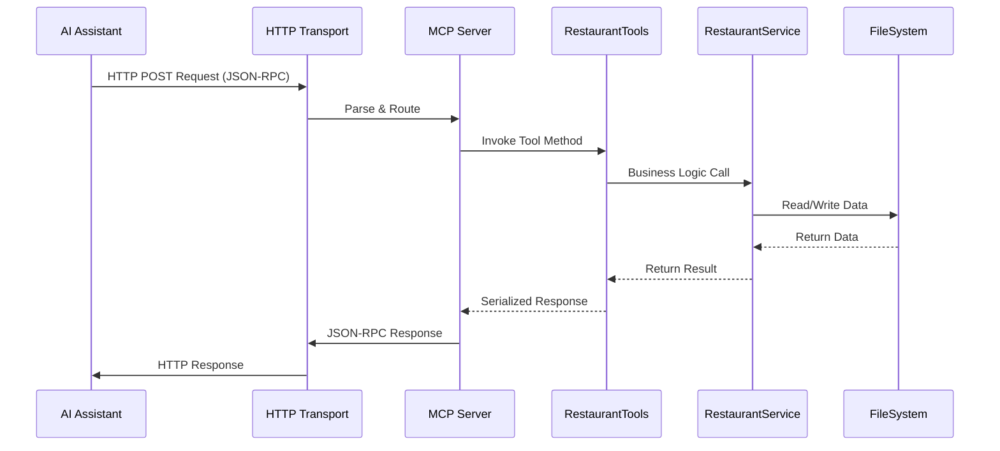

# MCP.http - Model Context Protocol HTTP Server

> A production-ready HTTP-based Model Context Protocol (MCP) server implementation for seamless AI assistant integration with restaurant management capabilities.

## 📋 Table of Contents

- [Introduction](#-introduction)
- [Architecture](#️-architecture)
- [Data Flow](#-data-flow)
- [Running the Server](#running-the-server)
- [Integration with AI Assistants](#integration-with-ai-assistants)

## 🌟 Introduction

The **MCP.http** server is a comprehensive implementation of the Model Context Protocol (MCP) specification using HTTP transport. Built on .NET 9.0 with ASP.NET Core, it provides seamless integration with AI assistants like VS Code with GitHub Copilot and other MCP-enabled applications through RESTful HTTP endpoints.

### Core Restaurant Management
- **GetRestaurants**: Get a list of all available restaurants
- **AddRestaurant**: Add a new restaurant with name, location, and food type
- **PickRandomRestaurant**: Randomly select a restaurant for lunch
- **GetVisitStatistics**: View statistics about restaurant visits

## 🏗️ Architecture

The MCP.http server follows a clean, service-oriented architecture optimized for HTTP transport:

```
┌────────────────────────────────────────────────────────────────────────────────────────────┐
│                                   MCP.http Server                                          │
├────────────────────────────────────────────────────────────────────────────────────────────┤
│  ┌──────────────────────┐  ┌──────────────────────┐  ┌──────────────────────────────┐      │
│  │        Tools         │  │      Services        │  │           Models             │      │
│  │                      │  │                      │  │                              │      │
│  │  RestaurantTools     │◄─┤  RestaurantService   │  │        Restaurant            │      │
│  │  [HTTP Endpoints]    │  │    [Singleton]       │  │        [JsonCtx]             │      │
│  │                      │  │  McpSessionService   │  │   AddRestaurantRequest       │      │
│  └──────────────────────┘  └──────────────────────┘  └──────────────────────────────┘      │
├────────────────────────────────────────────────────────────────────────────────────────────┤
│                          ASP.NET Core & HTTP Transport                                     │
│  ┌───────────────┐   ┌───────────────┐   ┌───────────────┐                                 │
│  │   Host/DI     │→──│  HTTP Server  │→──│   JSON-RPC    │                                 │
│  └───────────────┘   └───────────────┘   └───────────────┘                                 │
├────────────────────────────────────────────────────────────────────────────────────────────┤
│                                      Data Layer                                            │
│  ┌──────────────────────────────────────────────────────────────────────────────────────┐  │
│  │                        JSON File Storage (AppData)                                   │  │
│  │      %APPDATA%/LunchTimeMCP/restaurants.json                                         │  │
│  └──────────────────────────────────────────────────────────────────────────────────────┘  │
└────────────────────────────────────────────────────────────────────────────────────────────┘
```

## 🔄 Data Flow

### Standard MCP HTTP Request Flow



## Running the Server

### Command Line Execution
```bash
cd MCP.http
dotnet run
```

The server will start and listen for HTTP requests on `http://localhost:7071`.

### Testing with MCP Inspector
```bash
# Install MCP Inspector
npm install -g @modelcontextprotocol/inspector

# Run MCP Inspector and configure with HTTP URL
npx @modelcontextprotocol/inspector
# Then configure with URL: http://localhost:7071
```

## Integration with AI Assistants

### VS Code with GitHub Copilot

Create a `.vscode/mcp.json` file in your workspace:

```json
{
    "inputs": [],
    "servers": {
        "demo-mcp-http": {
            "type": "http",
            "url": "http://localhost:7071"
        }
    }
}
```

**Usage with GitHub Copilot Chat:**

1. **Start the MCP Server** - Run `dotnet run` in the MCP.http directory
2. **Open Copilot Chat** (`Ctrl+Shift+I` or `Cmd+Shift+I`) 
3. **Use MCP Tools** through natural language:

```
Show me all available restaurants from the restaurant management server
```

**Advanced Copilot Integration:**

```
@workspace I'm looking for Italian restaurants. Can you:
1. Show me current Italian restaurants
2. If none exist, add "Mario's Pizza" as an Italian restaurant downtown
3. Then pick between the Italian options
```

### Alternative Testing Methods

#### Method 1: Using MCP Inspector

1. **Run MCP Inspector**: `npx @modelcontextprotocol/inspector`
2. **Configure URL**: Set URL as `http://localhost:7071`
3. **Set Proxy Session Token**: Use token from console output
4. **Test Tools**: Start with Tools >> List Tools to see available tools

#### Method 2: Using REST Client Extension

1. **Install REST Client Extension**: Install "REST Client" by Huachao Mao from VS Code marketplace
2. **Use Test File**: Refer to [test-mcp-server.http](test-mcp-server.http) for example requests

