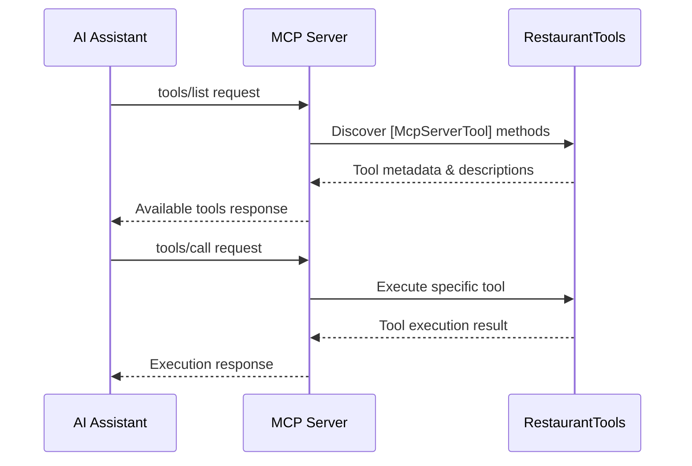

# MCP.stdio - Model Context Protocol Standard I/O Server

> A production-ready Standard I/O (stdio) based Model Context Protocol (MCP) server implementation for seamless AI assistant integration with restaurant management capabilities.

## 📋 Table of Contents

- [Introduction](#introduction)
- [Architecture](#architecture)
- [Data Flow](#data-flow)
- [Key Components](#key-components)
- [Local Development](#local-development)
- [Testing](#testing)
- [Deployment & CI/CD](#deployment--cicd)
- [MCP Integration](#mcp-integration)
- [Configuration](#configuration)

## 🌟 Introduction

The **MCP.stdio** server is a comprehensive implementation of the Model Context Protocol (MCP) specification using Standard I/O transport. Built on .NET 9.0 with the official Microsoft MCP SDK, it provides seamless integration with AI assistants like Claude Desktop, VS Code with GitHub Copilot, and other MCP-enabled applications.

### Key Features

- **🔌 Standard I/O Transport**: Native stdio communication for direct AI assistant integration
- **📡 Official MCP SDK**: Built with Microsoft's ModelContextProtocol library
- **🏪 Restaurant Management**: Complete CRUD operations with intelligent data handling
- **⚡ High Performance**: Asynchronous operations with optimized data processing
- **🔧 Zero Configuration**: Works out-of-the-box with AI assistants
- **📊 Visit Tracking**: Comprehensive restaurant visit statistics
- **🗃️ Persistent Storage**: JSON file-based data persistence
- **🛡️ Type Safety**: Full .NET type safety with source generators

### Use Cases

- AI assistant tool integration (Claude Desktop, VS Code Copilot)
- MCP protocol development and testing
- Educational MCP implementations
- Restaurant recommendation systems
- Local AI assistant backends

## 🏗️ Architecture

The MCP.stdio server follows a clean, service-oriented architecture optimized for stdio transport:

```
```
┌─────────────────────────────────────────────────────────────┐
│                      MCP.stdio Server                       │
├─────────────────────────────────────────────────────────────┤
│  ┌─────────────────┐  ┌─────────────────┐  ┌──────────────┐ │
│  │     Tools       │  │    Services     │  │    Models    │ │
│  │                 │  │                 │  │              │ │
│  │ RestaurantTools │◄─┤ RestaurantSvc   │  │ Restaurant   │ │
│  │ [McpServerTool] │  │ [Singleton]     │  │ [JsonCtx]    │ │
│  │                 │  │                 │  │              │ │
│  └─────────────────┘  └─────────────────┘  └──────────────┘ │
├─────────────────────────────────────────────────────────────┤
│                 Microsoft MCP SDK                           │
│  ┌─────────────────────────────────────────────────────────┐│
│  │              ModelContextProtocol.Server                ││
│  │  ┌───────────┐ ┌───────────┐ ┌────────────────────────┐ ││
│  │  │   Stdio   │→│ JSON-RPC  │→│   Tool Registration    │ ││
│  │  │ Transport │ │ 2.0 Proto │ │     & Execution        │ ││
│  │  └───────────┘ └───────────┘ └────────────────────────┘ ││
│  └─────────────────────────────────────────────────────────┘│
├─────────────────────────────────────────────────────────────┤
│                 .NET Host & DI Container                    │
│  ┌─────────────────────────────────────────────────────────┐│
│  │     Microsoft.Extensions.Hosting Infrastructure         ││
│  └─────────────────────────────────────────────────────────┘│
├─────────────────────────────────────────────────────────────┤
│                      Data Layer                             │
│  ┌─────────────────────────────────────────────────────────┐│
│  │           JSON File Storage (AppData)                   ││
│  │        %APPDATA%/MCP.stdio/restaurants.json             ││
│  └─────────────────────────────────────────────────────────┘│
└─────────────────────────────────────────────────────────────┘
```
```

### Architectural Principles

- **Official MCP Compliance**: Uses Microsoft's official MCP SDK
- **Stdio-First Design**: Optimized for standard I/O communication
- **Minimal Dependencies**: Lean dependency footprint for fast startup
- **Type-Safe Operations**: Leverages .NET's type system and source generators
- **Service-Oriented**: Clear separation between tools, services, and data

## 🔄 Data Flow

### Standard MCP Request Flow

```mermaid
sequenceDiagram
    participant AI as AI Assistant
    participant S as Stdio Transport
    participant MCP as MCP Server
    participant RT as RestaurantTools
    participant RS as RestaurantService
    participant FS as FileSystem

    AI->>S: JSON-RPC Request (stdin)
    S->>MCP: Parse & Route
    MCP->>RT: Invoke Tool Method
    RT->>RS: Business Logic Call
    RS->>FS: Read/Write Data
    FS-->>RS: Return Data
    RS-->>RT: Return Result
    RT-->>MCP: Serialized Response
    MCP->>S: JSON-RPC Response
    S->>AI: Response (stdout)
```



### Tool Registration & Discovery



### Data Persistence Pipeline

1. **Initialization**: Load existing data or create seed data
2. **Tool Execution**: Process restaurant operations
3. **Data Validation**: Ensure data integrity
4. **Persistence**: Atomic JSON file updates
5. **Response Generation**: Type-safe serialization

## 🔧 Key Components

### Core Components

#### 1. Program.cs (Entry Point)
```csharp
var builder = Host.CreateEmptyApplicationBuilder(settings: null);

builder.Services
    .AddMcpServer()                    // Register MCP server
    .WithStdioServerTransport()        // Configure stdio transport
    .WithTools<RestaurantTools>();     // Register tool class

builder.Services.AddSingleton<RestaurantService>();
```

#### 2. RestaurantTools (MCP Tool Provider)
- **Purpose**: Exposes restaurant functionality as MCP tools
- **Features**:
  - `[McpServerTool]` attribute-based tool registration
  - Type-safe parameter binding
  - Automatic JSON serialization
  - Descriptive tool metadata

#### 3. RestaurantService (Business Logic)
- **Purpose**: Core restaurant management functionality
- **Capabilities**:
  - CRUD operations for restaurants
  - Visit tracking and statistics
  - Data persistence and retrieval
  - Seed data initialization

### Data Models

#### Restaurant Model
```csharp
public class Restaurant
{
    public string Id { get; set; } = string.Empty;
    public string Name { get; set; } = string.Empty;
    public string Location { get; set; } = string.Empty;
    public string FoodType { get; set; } = string.Empty;
    public DateTime DateAdded { get; set; }
}
```

#### JSON Source Generation Context
```csharp
[JsonSerializable(typeof(Restaurant))]
[JsonSerializable(typeof(List<Restaurant>))]
public partial class RestaurantContext : JsonSerializerContext { }
```

### Available MCP Tools

| Tool Name | Description | Parameters | Return Type |
|-----------|-------------|------------|-------------|
| `GetRestaurants` | Retrieve all restaurants | None | `List<Restaurant>` |
| `AddRestaurant` | Add new restaurant | `name`, `location`, `foodType` | `Restaurant` |
| `PickRandomRestaurant` | Random selection with visit tracking | None | Selection result |
| `GetVisitStatistics` | Restaurant visit analytics | None | Statistics summary |

### Package Dependencies

```xml
<ItemGroup>
  <PackageReference Include="Microsoft.Extensions.Hosting" Version="9.0.6" />
  <PackageReference Include="ModelContextProtocol" Version="0.3.0-preview.1" />
  <PackageReference Include="System.Text.Json" Version="9.0.6" />
</ItemGroup>
    <PackageReference Include="Microsoft.Extensions.Hosting" Version="9.0.6" />
    <PackageReference Include="ModelContextProtocol" Version="0.3.0-preview.1" />
    <PackageReference Include="System.Text.Json" Version="9.0.6" />
</ItemGroup>
```

### Program.cs Setup
```csharp
using LunchTimeMCP;
using MCP.stdio;
using Microsoft.Extensions.DependencyInjection;
using Microsoft.Extensions.Hosting;
using ModelContextProtocol.Server;

var builder = Host.CreateEmptyApplicationBuilder(settings: null);

builder.Services
    .AddMcpServer()
    .WithStdioServerTransport()
    .WithTools<RestaurantTools>();

builder.Services.AddSingleton<RestaurantService>();

await builder.Build().RunAsync();
```

## Running the Server

### Command Line Execution
```bash
cd MCP.stdio
dotnet run
```

The server will start and wait for MCP protocol messages via stdin/stdout.

### Testing with MCP Inspector
```bash
# Install MCP Inspector
npm install -g @modelcontextprotocol/inspector

# Run with MCP Inspector
npx @modelcontextprotocol/inspector dotnet run
```

## Integration with AI Assistants

### VS Code with GitHub Copilot

Create a `.vscode/mcp.json` file in your workspace:

```json
{
    "inputs": [],
    "servers": {
        "lunchroulette": {
            "type": "stdio",
            "command": "dotnet",
            "args": [
                "run",
                "--project",
                "PATH_TO_YOUR_PROJECT\\MCP.stdio\\MCP.stdio.csproj"
            ],
            "env": {}
        }
    }
}
```

**Important**: Update the project path to match your actual file system location.

### Claude Desktop

Add to your Claude Desktop configuration:

```json
{
  "mcpServers": {
    "lunchroulette": {
      "command": "dotnet",
      "args": [
        "run",
        "--project",
        "PATH_TO_YOUR_PROJECT\\MCP.stdio\\MCP.stdio.csproj"
      ]
    }
  }
}
```

## Tool Definitions

### GetRestaurants
- **Purpose**: Retrieve all available restaurants
- **Parameters**: None
- **Returns**: JSON array of restaurant objects

### AddRestaurant
- **Purpose**: Add a new restaurant to the database
- **Parameters**:
  - `name` (string): The name of the restaurant
  - `location` (string): The location/address of the restaurant
  - `foodType` (string): The type of food served (e.g., Italian, Mexican, Thai)
- **Returns**: The newly created restaurant object

### PickRandomRestaurant
- **Purpose**: Select a random restaurant and track the visit
- **Parameters**: None
- **Returns**: Selected restaurant with a friendly message

### GetVisitStatistics
- **Purpose**: Retrieve formatted statistics about restaurant visits
- **Parameters**: None
- **Returns**: Comprehensive visit statistics with counts and totals

## Data Storage

Restaurant data is stored in JSON format in the user's application data directory:
- **Windows**: `%APPDATA%\LunchTimeMCP\restaurants.json`
- **macOS/Linux**: `~/.config/LunchTimeMCP/restaurants.json`

### Data Structure
```json
{
  "restaurants": [
    {
      "id": "guid",
      "name": "Restaurant Name",
      "location": "Address",
      "foodType": "Cuisine Type",
      "dateAdded": "2024-01-15T10:30:00Z"
    }
  ],
  "visitCounts": {
    "restaurant-id": 5
  }
}
```

## Usage Examples

### Using with GitHub Copilot in VS Code
After setting up the MCP configuration:

- **"Pick a random restaurant for lunch"**
- **"Add a new restaurant called 'Spago' in Beverly Hills serving Californian cuisine"**
- **"Show me all available restaurants"**
- **"Get statistics on restaurant visits"**

### Direct MCP Protocol Communication
```json
{
  "jsonrpc": "2.0",
  "id": 1,
  "method": "tools/call",
  "params": {
    "name": "GetRestaurants"
  }
}
```

## Architecture Benefits

### Advantages of Stdio Transport
- **Direct Integration**: Works seamlessly with AI assistants
- **Simple Protocol**: Standard input/output communication
- **Lightweight**: Minimal overhead and resource usage
- **Secure**: No network exposure or ports to manage

### MCP Library Benefits
- **Protocol Compliance**: Official MCP specification implementation
- **Automatic Handling**: Request/response parsing and validation
- **Tool Registration**: Automatic discovery and registration
- **Error Management**: Built-in error handling and responses

## Differences from MCP.sse

| Feature | MCP.stdio | MCP.sse |
|---------|-----------|---------|
| Transport | Standard I/O | HTTP/SSE |
| Protocol | JSON-RPC over stdio | JSON-RPC over HTTP |
| Real-time | Not supported | Server-Sent Events |
| Web Integration | Not supported | Full support |
| AI Assistant Support | Native | Configuration required |
| Debugging | Console logs | Web dev tools |
| Scalability | Single process | Multiple connections |
| Setup Complexity | Simple | Moderate |

## Development Notes

### MCP Tool Attributes
- **`[McpServerToolType]`**: Marks a class as containing MCP tools
- **`[McpServerTool]`**: Registers a method as an MCP tool
- **`[Description]`**: Provides tool and parameter descriptions for AI

### Dependency Injection
- Services are registered as singletons for data consistency
- Constructor injection provides access to required services
- Tools are automatically discovered and registered

### JSON Serialization
- Uses System.Text.Json with source generators
- Optimized for performance with AOT compilation
- Type-safe serialization with compile-time validation

## Troubleshooting

### Common Issues
1. **"Server not found"**: Check file paths in MCP configuration
2. **"Tool not available"**: Verify tool registration in Program.cs
3. **"Data not persisting"**: Check write permissions to AppData directory

### Debugging
- Add console logging to track MCP communication
- Use MCP Inspector for interactive testing
- Verify JSON serialization with test data

### Performance Tips
- Use async/await for all I/O operations
- Minimize file system access with in-memory caching
- Use source generators for optimal JSON performance

## Future Enhancements
- Resource support for rich content
- Prompt templates for common operations
- Enhanced error reporting and validation
- Performance monitoring and metrics
- Additional restaurant management features

## 💻 Local Development

### Prerequisites

- **.NET 9.0 SDK** or later
- **Visual Studio 2022** (17.8+) or **VS Code** with C# extension
- **Git** for version control
- **PowerShell** (Windows) or **Bash** (Linux/macOS)
- **AI Assistant** (Claude Desktop, VS Code with GitHub Copilot, etc.)

### Setup Instructions

#### 1. Clone Repository
```powershell
git clone <repository-url>
cd MCPDemo/MCP.stdio
```

#### 2. Restore Dependencies
```powershell
dotnet restore
```

#### 3. Build Application
```powershell
# Debug build
dotnet build

# Release build
dotnet build -c Release
```

#### 4. Test Local Execution
```powershell
# Run the application directly
dotnet run

# The server will start and wait for stdio input
# Press Ctrl+C to exit
```

#### 5. Verify MCP Protocol
```powershell
# Send initialize request via stdin (for testing)
echo '{"jsonrpc":"2.0","id":1,"method":"initialize","params":{"protocolVersion":"2024-11-05","capabilities":{"tools":{}},"clientInfo":{"name":"test","version":"1.0.0"}}}' | dotnet run
```

### Development Tools

#### Visual Studio Integration
- **Project Templates**: Console application with MCP server setup
- **Debugging**: Full breakpoint and step-through support
- **NuGet Management**: Easy package updates and dependency management

#### VS Code Integration
- **C# Extension**: Syntax highlighting and IntelliSense
- **Debugger**: Attach to process debugging
- **Tasks**: Pre-configured build and run tasks

### File Structure
```
MCP.stdio/
├── Program.cs                   # Application entry point & DI setup
├── RestaurantService.cs         # Core business logic
├── RestaurantTools.cs           # MCP tool implementations
├── MCP.stdio.csproj            # Project file with dependencies
├── README.md                   # This documentation
└── bin/                        # Build output directory
    └── Debug/net9.0/
        └── MCP.stdio.exe       # Executable for AI assistant integration
```

## 🧪 Testing

### Manual Testing

#### Direct Console Testing
```powershell
# Navigate to project directory
cd MCP.stdio

# Run the server
dotnet run

# In another terminal, send MCP commands via stdin
echo '{"jsonrpc":"2.0","id":1,"method":"tools/list","params":{}}' | dotnet run
```

#### PowerShell Testing Script
```powershell
# test-mcp.ps1
$process = Start-Process -FilePath "dotnet" -ArgumentList "run" -NoNewWindow -PassThru -RedirectStandardInput -RedirectStandardOutput

# Initialize connection
$initRequest = '{"jsonrpc":"2.0","id":1,"method":"initialize","params":{"protocolVersion":"2024-11-05","capabilities":{"tools":{}},"clientInfo":{"name":"test","version":"1.0.0"}}}'
$process.StandardInput.WriteLine($initRequest)

# List tools
$toolsRequest = '{"jsonrpc":"2.0","id":2,"method":"tools/list","params":{}}'
$process.StandardInput.WriteLine($toolsRequest)

# Call GetRestaurants
$getRestaurants = '{"jsonrpc":"2.0","id":3,"method":"tools/call","params":{"name":"GetRestaurants","arguments":{}}}'
$process.StandardInput.WriteLine($getRestaurants)

$process.StandardInput.Close()
$output = $process.StandardOutput.ReadToEnd()
Write-Host $output
```

#### JSON-RPC Test Messages

##### Initialize Connection
```json
{
  "jsonrpc": "2.0",
  "id": 1,
  "method": "initialize",
  "params": {
    "protocolVersion": "2024-11-05",
    "capabilities": {
      "tools": {}
    },
    "clientInfo": {
      "name": "test-client",
      "version": "1.0.0"
    }
  }
}
```

##### List Available Tools
```json
{
  "jsonrpc": "2.0",
  "id": 2,
  "method": "tools/list",
  "params": {}
}
```

##### Call AddRestaurant Tool
```json
{
  "jsonrpc": "2.0",
  "id": 3,
  "method": "tools/call",
  "params": {
    "name": "AddRestaurant",
    "arguments": {
      "name": "Tony's Pizzeria",
      "location": "456 Sunset Blvd",
      "foodType": "Italian"
    }
  }
}
```

### Integration Testing with AI Assistants

#### Claude Desktop Configuration
Create or update `claude_desktop_config.json`:

```json
{
  "mcpServers": {
    "restaurant-manager": {
      "command": "dotnet",
      "args": ["run", "--project", "C:/Code/GitHub/DemoMCP/MCPDemo/MCP.stdio"],
      "env": {
        "DOTNET_ENVIRONMENT": "Development"
      }
    }
  }
}
```

**File Locations:**
- **Windows**: `%APPDATA%\Claude\claude_desktop_config.json`
- **macOS**: `~/Library/Application Support/Claude/claude_desktop_config.json`
- **Linux**: `~/.config/Claude/claude_desktop_config.json`

#### VS Code with GitHub Copilot
Add to VS Code settings or workspace configuration:

```json
{
  "github.copilot.mcp.servers": {
    "restaurant-manager": {
      "command": "dotnet",
      "args": ["run", "--project", "./MCP.stdio"],
      "cwd": "${workspaceFolder}"
    }
  }
}
```

### Automated Testing

#### Unit Tests Setup
```powershell
# Create test project
dotnet new xunit -n MCP.stdio.Tests
cd MCP.stdio.Tests
dotnet add reference ../MCP.stdio.csproj
dotnet add package Microsoft.Extensions.DependencyInjection.Abstractions
dotnet add package Microsoft.Extensions.Hosting.Abstractions
```

#### Sample Unit Test
```csharp
[Fact]
public async Task RestaurantService_AddRestaurant_ShouldReturnValidRestaurant()
{
    // Arrange
    var service = new RestaurantService();
    
    // Act
    var result = await service.AddRestaurantAsync("Test Restaurant", "123 Test St", "Test Food");
    
    // Assert
    Assert.NotNull(result);
    Assert.Equal("Test Restaurant", result.Name);
    Assert.NotEmpty(result.Id);
}

[Fact]
public async Task RestaurantTools_GetRestaurants_ShouldReturnJsonString()
{
    // Arrange
    var service = new RestaurantService();
    var tools = new RestaurantTools(service);
    
    // Act
    var result = await tools.GetRestaurants();
    
    // Assert
    Assert.NotNull(result);
    Assert.True(result.StartsWith("[") && result.EndsWith("]"));
}
```

## 🚀 Deployment & CI/CD

### Deployment Options

#### 1. Standalone Executable

##### Self-Contained Deployment
```powershell
# Windows x64
dotnet publish -c Release -r win-x64 --self-contained true -p:PublishSingleFile=true

# Linux x64
dotnet publish -c Release -r linux-x64 --self-contained true -p:PublishSingleFile=true

# macOS x64
dotnet publish -c Release -r osx-x64 --self-contained true -p:PublishSingleFile=true

# macOS ARM64 (Apple Silicon)
dotnet publish -c Release -r osx-arm64 --self-contained true -p:PublishSingleFile=true
```

##### Framework-Dependent Deployment
```powershell
# Requires .NET 9.0 runtime on target machine
dotnet publish -c Release --no-self-contained -p:PublishSingleFile=true
```

#### 2. NuGet Package Distribution

##### Create NuGet Package
```powershell
# Add to .csproj
<PropertyGroup>
  <PackAsTool>true</PackAsTool>
  <ToolCommandName>mcp-stdio</ToolCommandName>
  <PackageId>LunchTime.MCP.Stdio</PackageId>
  <Version>1.0.0</Version>
  <Authors>Your Name</Authors>
  <Description>MCP.stdio restaurant management server</Description>
</PropertyGroup>

# Build and pack
dotnet pack -c Release

# Install globally
dotnet tool install -g LunchTime.MCP.Stdio

# Use from anywhere
mcp-stdio
```

#### 3. Docker Containerization

##### Dockerfile
```dockerfile
FROM mcr.microsoft.com/dotnet/runtime:9.0 AS base
WORKDIR /app

FROM mcr.microsoft.com/dotnet/sdk:9.0 AS build
WORKDIR /src
COPY ["MCP.stdio.csproj", "./"]
RUN dotnet restore "MCP.stdio.csproj"
COPY . .
RUN dotnet build "MCP.stdio.csproj" -c Release -o /app/build

FROM build AS publish
RUN dotnet publish "MCP.stdio.csproj" -c Release -o /app/publish

FROM base AS final
WORKDIR /app
COPY --from=publish /app/publish .
ENTRYPOINT ["dotnet", "MCP.stdio.dll"]
```

##### Build and Run
```powershell
# Build image
docker build -t mcp-stdio-server .

# Run container with stdio
docker run -i mcp-stdio-server

# Interactive testing
echo '{"jsonrpc":"2.0","id":1,"method":"tools/list"}' | docker run -i mcp-stdio-server
```

### CI/CD Pipelines

#### GitHub Actions

##### .github/workflows/build-and-test.yml
```yaml
name: Build and Test MCP.stdio

on:
  push:
    branches: [ main, develop ]
  pull_request:
    branches: [ main ]

jobs:
  build-and-test:
    runs-on: ${{ matrix.os }}
    strategy:
      matrix:
        os: [ubuntu-latest, windows-latest, macos-latest]
    
    steps:
    - uses: actions/checkout@v4
    
    - name: Setup .NET
      uses: actions/setup-dotnet@v4
      with:
        dotnet-version: '9.0.x'
    
    - name: Restore dependencies
      run: dotnet restore MCP.stdio/MCP.stdio.csproj
    
    - name: Build
      run: dotnet build MCP.stdio/MCP.stdio.csproj --no-restore -c Release
    
    - name: Test
      run: dotnet test MCP.stdio.Tests/MCP.stdio.Tests.csproj --no-build --verbosity normal
    
    - name: Publish Self-Contained (Windows)
      if: matrix.os == 'windows-latest'
      run: dotnet publish MCP.stdio/MCP.stdio.csproj -c Release -r win-x64 --self-contained -p:PublishSingleFile=true -o ./artifacts/win-x64
    
    - name: Publish Self-Contained (Linux)
      if: matrix.os == 'ubuntu-latest'
      run: dotnet publish MCP.stdio/MCP.stdio.csproj -c Release -r linux-x64 --self-contained -p:PublishSingleFile=true -o ./artifacts/linux-x64
    
    - name: Publish Self-Contained (macOS)
      if: matrix.os == 'macos-latest'
      run: dotnet publish MCP.stdio/MCP.stdio.csproj -c Release -r osx-x64 --self-contained -p:PublishSingleFile=true -o ./artifacts/osx-x64
    
    - name: Upload Artifacts
      uses: actions/upload-artifact@v4
      with:
        name: mcp-stdio-${{ matrix.os }}
        path: ./artifacts/
```

##### .github/workflows/release.yml
```yaml
name: Release MCP.stdio

on:
  push:
    tags: [ 'v*' ]

jobs:
  release:
    runs-on: ubuntu-latest
    
    steps:
    - uses: actions/checkout@v4
    
    - name: Setup .NET
      uses: actions/setup-dotnet@v4
      with:
        dotnet-version: '9.0.x'
    
    - name: Build Multi-Platform
      run: |
        dotnet publish MCP.stdio/MCP.stdio.csproj -c Release -r win-x64 --self-contained -p:PublishSingleFile=true -o ./release/win-x64
        dotnet publish MCP.stdio/MCP.stdio.csproj -c Release -r linux-x64 --self-contained -p:PublishSingleFile=true -o ./release/linux-x64
        dotnet publish MCP.stdio/MCP.stdio.csproj -c Release -r osx-x64 --self-contained -p:PublishSingleFile=true -o ./release/osx-x64
        dotnet publish MCP.stdio/MCP.stdio.csproj -c Release -r osx-arm64 --self-contained -p:PublishSingleFile=true -o ./release/osx-arm64
    
    - name: Create Release
      uses: softprops/action-gh-release@v1
      with:
        files: |
          ./release/win-x64/MCP.stdio.exe
          ./release/linux-x64/MCP.stdio
          ./release/osx-x64/MCP.stdio
          ./release/osx-arm64/MCP.stdio
        generate_release_notes: true
```

#### Azure DevOps

##### azure-pipelines.yml
```yaml
trigger:
- main

pool:
  vmImage: 'ubuntu-latest'

variables:
  buildConfiguration: 'Release'
  projectPath: 'MCP.stdio/MCP.stdio.csproj'

stages:
- stage: Build
  jobs:
  - job: BuildAndTest
    steps:
    - task: UseDotNet@2
      displayName: 'Use .NET 9.0'
      inputs:
        packageType: 'sdk'
        version: '9.0.x'

    - task: DotNetCoreCLI@2
      displayName: 'Restore packages'
      inputs:
        command: 'restore'
        projects: '$(projectPath)'

    - task: DotNetCoreCLI@2
      displayName: 'Build project'
      inputs:
        command: 'build'
        projects: '$(projectPath)'
        arguments: '--configuration $(buildConfiguration) --no-restore'

    - task: DotNetCoreCLI@2
      displayName: 'Run tests'
      inputs:
        command: 'test'
        projects: 'MCP.stdio.Tests/MCP.stdio.Tests.csproj'
        arguments: '--configuration $(buildConfiguration) --no-build'

- stage: Publish
  dependsOn: Build
  condition: and(succeeded(), eq(variables['Build.SourceBranch'], 'refs/heads/main'))
  jobs:
  - job: PublishArtifacts
    steps:
    - task: DotNetCoreCLI@2
      displayName: 'Publish Windows x64'
      inputs:
        command: 'publish'
        projects: '$(projectPath)'
        arguments: '-c Release -r win-x64 --self-contained -p:PublishSingleFile=true -o $(Build.ArtifactStagingDirectory)/win-x64'

    - task: DotNetCoreCLI@2
      displayName: 'Publish Linux x64'
      inputs:
        command: 'publish'
        projects: '$(projectPath)'
        arguments: '-c Release -r linux-x64 --self-contained -p:PublishSingleFile=true -o $(Build.ArtifactStagingDirectory)/linux-x64'

    - task: PublishBuildArtifacts@1
      displayName: 'Publish Build Artifacts'
      inputs:
        pathToPublish: '$(Build.ArtifactStagingDirectory)'
        artifactName: 'mcp-stdio-binaries'
```

### Environment Configuration

#### Development Environment
```json
// appsettings.Development.json (if using configuration)
{
  "Logging": {
    "LogLevel": {
      "Default": "Debug",
      "Microsoft": "Warning"
    }
  },
  "DataPath": "%TEMP%/MCP.stdio.dev"
}
```

#### Production Environment
```json
// appsettings.Production.json
{
  "Logging": {
    "LogLevel": {
      "Default": "Information",
      "Microsoft": "Warning"
    }
  }
}
```

## 🤖 MCP Integration

### AI Assistant Configuration

#### Claude Desktop Integration

1. **Locate Configuration File**:
   - **Windows**: `%APPDATA%\Claude\claude_desktop_config.json`
   - **macOS**: `~/Library/Application Support/Claude/claude_desktop_config.json`
   - **Linux**: `~/.config/Claude/claude_desktop_config.json`

2. **Add MCP Server Configuration**:
```json
{
  "mcpServers": {
    "restaurant-manager": {
      "command": "C:/path/to/MCP.stdio.exe",
      "args": [],
      "env": {
        "DOTNET_ENVIRONMENT": "Production"
      }
    }
  }
}
```

3. **Using Development Build**:
```json
{
  "mcpServers": {
    "restaurant-manager-dev": {
      "command": "dotnet",
      "args": ["run", "--project", "C:/Code/GitHub/DemoMCP/MCPDemo/MCP.stdio"],
      "env": {
        "DOTNET_ENVIRONMENT": "Development"
      }
    }
  }
}
```

#### VS Code GitHub Copilot Integration

Add to VS Code `settings.json`:
```json
{
  "github.copilot.mcp.servers": {
    "restaurant-manager": {
      "command": "C:/path/to/MCP.stdio.exe",
      "args": [],
      "timeout": 30000
    }
  }
}
```

#### Generic MCP Client Integration

The server follows standard MCP protocol and can integrate with any MCP-compatible client:

```typescript
// Example client integration (TypeScript/JavaScript)
import { spawn } from 'child_process';

const mcpProcess = spawn('MCP.stdio.exe', [], {
  stdio: ['pipe', 'pipe', 'pipe']
});

// Send initialize request
const initRequest = {
  jsonrpc: '2.0',
  id: 1,
  method: 'initialize',
  params: {
    protocolVersion: '2024-11-05',
    capabilities: { tools: {} },
    clientInfo: { name: 'custom-client', version: '1.0.0' }
  }
};

mcpProcess.stdin.write(JSON.stringify(initRequest) + '\n');
```

### Tool Usage Examples

#### Using in Claude Desktop

Once configured, you can use natural language commands:

- *"Show me all the restaurants"* → Calls `GetRestaurants`
- *"Add a new Italian restaurant called Mario's on Main Street"* → Calls `AddRestaurant`
- *"Pick a random place for lunch"* → Calls `PickRandomRestaurant`
- *"Show me visit statistics"* → Calls `GetVisitStatistics`

#### Programmatic Usage

```csharp
// Example of calling tools programmatically through MCP
var toolCall = new
{
    jsonrpc = "2.0",
    id = 3,
    method = "tools/call",
    @params = new
    {
        name = "AddRestaurant",
        arguments = new
        {
            name = "New Restaurant",
            location = "123 Main St",
            foodType = "American"
        }
    }
};
```

## ⚙️ Configuration

### Application Configuration

#### Project File Configuration
```xml
<Project Sdk="Microsoft.NET.Sdk">
  <PropertyGroup>
    <OutputType>Exe</OutputType>
    <TargetFramework>net9.0</TargetFramework>
    <ImplicitUsings>enable</ImplicitUsings>
    <Nullable>enable</Nullable>
    
    <!-- Optional: Enable ready-to-run for faster startup -->
    <PublishReadyToRun>true</PublishReadyToRun>
    
    <!-- Optional: Trim unused code for smaller deployments -->
    <PublishTrimmed>true</PublishTrimmed>
  </PropertyGroup>
</Project>
```

#### Runtime Configuration
Environment variables for runtime behavior:
- `DOTNET_ENVIRONMENT`: Development, Staging, Production
- `ASPNETCORE_ENVIRONMENT`: Alternative environment setting
- `MCP_STDIO_LOG_LEVEL`: Override logging level
- `MCP_STDIO_DATA_PATH`: Custom data storage path

### Data Storage Configuration

#### Default Storage Locations
- **Windows**: `%APPDATA%\MCP.stdio\restaurants.json`
- **macOS**: `~/.config/MCP.stdio/restaurants.json`
- **Linux**: `~/.config/MCP.stdio/restaurants.json`

#### Custom Storage Path
```csharp
// In RestaurantService constructor
var customPath = Environment.GetEnvironmentVariable("MCP_STDIO_DATA_PATH");
var appDir = string.IsNullOrEmpty(customPath) 
    ? Path.Combine(Environment.GetFolderPath(Environment.SpecialFolder.ApplicationData), "MCP.stdio")
    : customPath;
```

#### Data Format
```json
{
  "restaurants": [
    {
      "id": "guid-string",
      "name": "Restaurant Name",
      "location": "Address",
      "foodType": "Cuisine Type",
      "dateAdded": "2024-01-15T10:30:00Z"
    }
  ],
  "visitCounts": {
    "restaurant-id": 5
  }
}
```

### Performance Configuration

#### Memory Optimization
```csharp
// In Program.cs - configure JSON options for better performance
builder.Services.Configure<JsonOptions>(options =>
{
    options.SerializerOptions.DefaultBufferSize = 1024;
    options.SerializerOptions.PropertyNamingPolicy = JsonNamingPolicy.CamelCase;
});
```

#### Startup Optimization
```xml
<!-- Add to .csproj for faster startup -->
<PropertyGroup>
  <TieredCompilation>true</TieredCompilation>
  <TieredCompilationQuickJit>true</TieredCompilationQuickJit>
</PropertyGroup>
```

---

## 📞 Support & Contributing

- **Issues**: Report bugs and feature requests via GitHub Issues
- **Documentation**: MCP Protocol specification and API documentation
- **Contributing**: Follow standard Git workflow with pull requests
- **License**: [Specify your license here]
- **MCP Resources**: [Model Context Protocol Documentation](https://modelcontextprotocol.io/)

Built with ❤️ using .NET 9.0 and the official Microsoft Model Context Protocol SDK.
