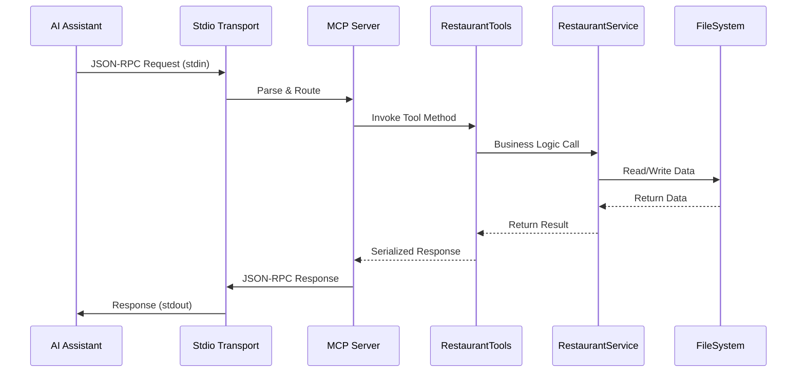

# MCP.stdio - Model Context Protocol Standard I/O Server

> A production-ready Standard I/O (stdio) based Model Context Protocol (MCP) server implementation for seamless AI assistant integration with restaurant management capabilities.

## 📋 Table of Contents

- [Introduction](#-introduction)
- [Architecture](#️-architecture)
- [Data Flow](#-data-flow)
- [Running the Server](#running-the-server)
- [Testing the Server](#testing-methods)
- [Integration with AI Assistants](#integration-with-ai-assistants)

## 🌟 Introduction

The **MCP.stdio** server is a comprehensive implementation of the Model Context Protocol (MCP) specification using Standard I/O transport. Built on .NET 9.0 with the official Microsoft MCP SDK, it provides seamless integration with AI assistants like Claude Desktop, VS Code with GitHub Copilot, and other MCP-enabled applications.

## 🏗️ Architecture

The MCP.stdio server follows a clean, service-oriented architecture optimized for stdio transport:

```
┌────────────────────────────────────────────────────────────────────────────────────────────┐
│                                   MCP.stdio Server                                         │
├────────────────────────────────────────────────────────────────────────────────────────────┤
│  ┌──────────────────────┐  ┌──────────────────────┐  ┌──────────────────────────────┐      │
│  │        Tools         │  │      Services        │  │           Models             │      │
│  │                      │  │                      │  │                              │      │
│  │  RestaurantTools     │◄─┤  RestaurantService   │  │        Restaurant            │      │
│  │  [McpServerTool]     │  │    [Singleton]       │  │        [JsonCtx]             │      │
│  │                      │  │                      │  │                              │      │
│  └──────────────────────┘  └──────────────────────┘  └──────────────────────────────┘      │
├────────────────────────────────────────────────────────────────────────────────────────────┤
│                          .NET Host & Stdio Transport                                       │
│  ┌───────────────┐   ┌───────────────┐   ┌───────────────┐                                 │
│  │   Host/DI     │→──│  Stdio Comm.  │→──│   JSON-RPC    │                                 │
│  └───────────────┘   └───────────────┘   └───────────────┘                                 │
├────────────────────────────────────────────────────────────────────────────────────────────┤
│                                      Data Layer                                            │
│  ┌──────────────────────────────────────────────────────────────────────────────────────┐  │
│  │                        JSON File Storage (AppData)                                   │  │
│  │      %APPDATA%/LunchTimeMCP/restaurants.json                                         │  │
│  └──────────────────────────────────────────────────────────────────────────────────────┘  │
└────────────────────────────────────────────────────────────────────────────────────────────┘
```
## 🔄 Data Flow

### Standard MCP Request Flow




## Running the Server

### Command Line Execution
```bash
cd MCP.stdio
dotnet run
```

The server will start and wait for MCP protocol messages via stdin/stdout.

## Testing Methods

### Method 1: Using MCP Inspector
```bash
# Install MCP Inspector
npm install -g @modelcontextprotocol/inspector

# Run with MCP Inspector
npx @modelcontextprotocol/inspector dotnet run
```

### Method 2: Using VS Code with GitHub Copilot

Create a `.vscode/mcp.json` file in your workspace:

```json
{
    "inputs": [],
    "servers": {
        "lunchroulette": {
            "type": "stdio",
            "command": "dotnet",
            "args": [
                "run",
                "--project",
                "PATH_TO_YOUR_PROJECT\\MCP.stdio\\MCP.stdio.csproj"
            ],
            "env": {}
        }
    }
}
```

**Important**: Update the project path to match your actual file system location.

### Claude Desktop

Add to your Claude Desktop configuration:

```json
{
  "mcpServers": {
    "mcp-test-console": {
      "command": "dotnet",
      "args": [
        "run",
        "--project",
        "PATH_TO_YOUR_PROJECT\\MCP.stdio\\MCP.stdio.csproj"
      ]
    }
  }
}
```

